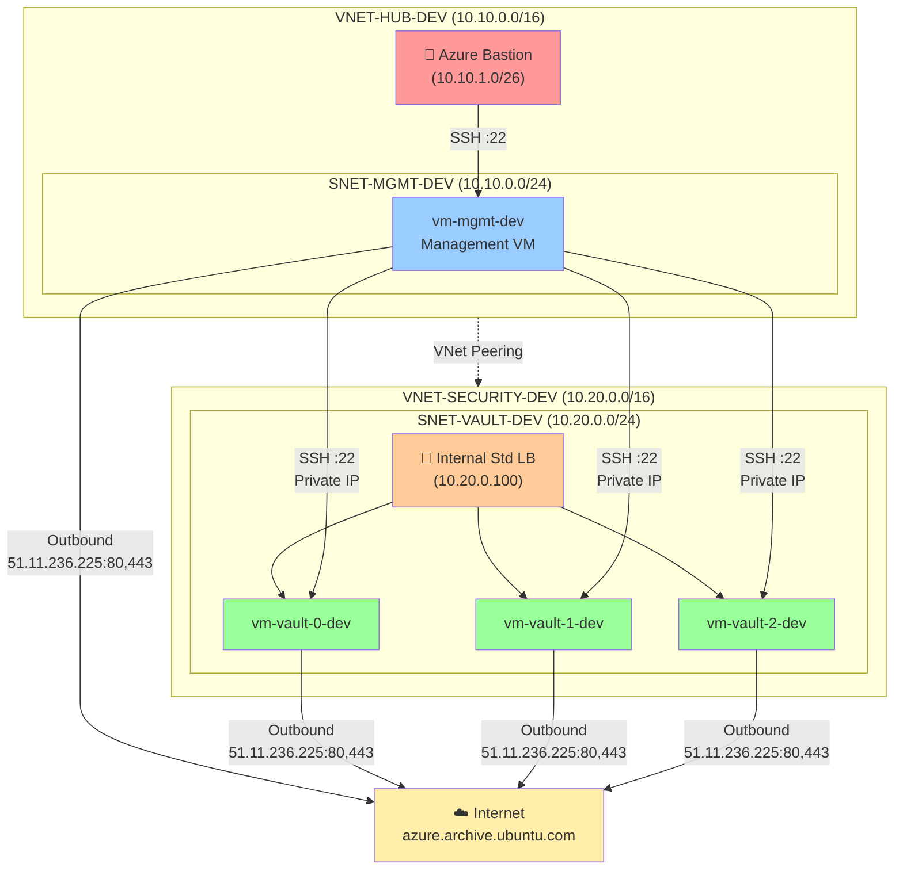
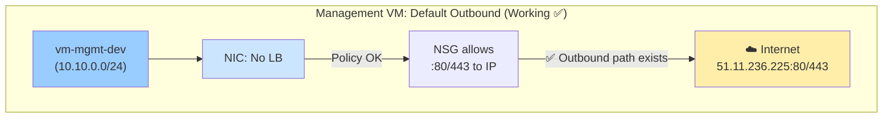
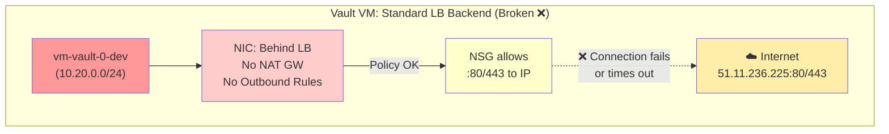
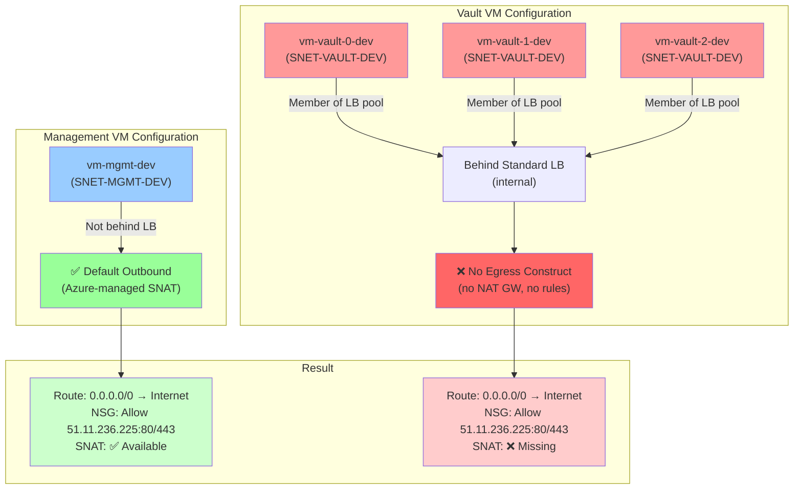
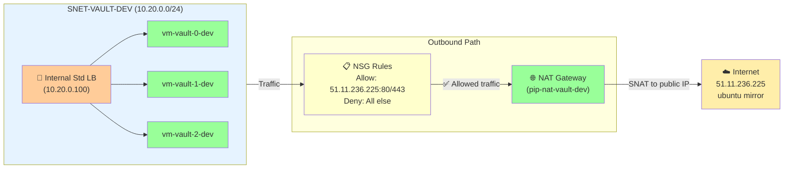

# Controlled Outbound Connectivity in a Secure Azure Hub/Spoke: Why One VM Can Patch and Another Cannot

## 1. Introduction

This article describes a real-world Azure networking scenario where two virtual machines, built with the same security philosophy and similar outbound controls, behave very differently:

- A **management VM** in a hub virtual network can successfully reach `azure.archive.ubuntu.com` and run `apt update`.
- A **Vault VM** in a security spoke virtual network, hosting a HashiCorp Vault node behind an internal Standard Load Balancer, cannot reach the same endpoint, even though:
  - Both VMs have a default route `0.0.0.0/0` with `NextHopType = Internet`.
  - Network Security Groups (NSGs) explicitly allow outbound HTTP/HTTPS to the IP address that backs `azure.archive.ubuntu.com` in the region.
  - No VM has a public IP.

The objective is not to provide a step-by-step implementation guide, but to:

- Explain the **architecture** of a secure Azure hub/spoke design focusing on:
  - `VNET-HUB-DEV` and its management subnet `SNET-MGMT-DEV`.
  - `VNET-SECURITY-DEV` and its Vault subnet `SNET-VAULT-DEV`.
- Show how perfectly reasonable **security assumptions** (NSGs + default routes) can fail when a VM is part of a **Standard Load Balancer backend pool**.
- Prepare the ground for the solution: introducing an explicit egress mechanism (such as a NAT Gateway) while keeping a strict “no public IP on workloads” policy.

The rest of the document will use this use case as a lens to discuss:

- How to architect hub/spoke networks for strong isolation and controlled administration.
- How Azure outbound connectivity really behaves when you mix NSGs, route tables, and load balancers.
- Design patterns that cloud and security architects can adopt to avoid similar surprises in production.

---

## 2. Architecture Overview: Secure Hub/Spoke Only

This section focuses on the minimal architecture involved in the problem, limited to:

- A **hub VNet** dedicated to shared services and administration: `VNET-HUB-DEV`.
- A **security spoke VNet** dedicated to sensitive workloads: `VNET-SECURITY-DEV`.

We deliberately ignore any additional application VNets or DevOps agent subnets to keep the narrative centered on the observed behaviour between the management VM and the Vault VM.

### 2.1 Network topology

The topology is a classic, opinionated hub/spoke design.

- **Hub VNet: `VNET-HUB-DEV`**
  - Management subnet (`SNET-MGMT-DEV`) with management VM (`vm-mgmt-dev`).
  - Connected to Azure Bastion for secure SSH access.

- **Security VNet: `VNET-SECURITY-DEV`**
  - Vault subnet (`SNET-VAULT-DEV`) with Vault VMs behind an internal Standard Load Balancer.
  - No public IPs on workloads.

- **VNet peering**
  - Hub and security VNets are peered.
  - Management VM reaches Vault VMs via private IP over SSH.

- **Security Model and NSG Strategy**

The security posture rests on three pillars:

  - **Inbound:** Strictly limited access.
    - `SNET-MGMT-DEV`: Only Azure Bastion can SSH to the management VM.
    - `SNET-VAULT-DEV`: SSH allowed only from the management subnet.

  - **Outbound:** Controlled egress for OS patching.
    - Both subnets allow HTTP/HTTPS only to `51.11.236.225` (Ubuntu mirror IP in `francecentral`).
    - All other Internet traffic is denied via deny-all NSG rules.

  - **Administrative flows:** Fully private.
    - Operator → Bastion → Management VM → Vault VMs (all via private IPs).

On paper, this model is consistent: identical outbound intent, matching routes (`0.0.0.0/0 → Internet`), and correctly configured NSGs.

This architecture enforces:
- No public IPs on servers.
- All access through controlled entry points (Bastion, load balancer).
- Strong isolation between hub (administration) and spoke (security workloads).

The challenge emerges when considering **outbound connectivity** under these constraints.

## 3. The Outbound Puzzle: Same Intent, Different Behaviour

Despite having a consistent security philosophy and apparently similar routing, the two VMs do not behave the same way when they attempt outbound connections.
The **Standard Load Balancer backend pool membership**, which changes how Azure handles outbound connectivity.

### 3.1 Observed Behaviour

- **Management VM** (`vm-mgmt-dev`): Can reach Ubuntu mirror IP `51.11.236.225:80/443`. `apt update` works.
- **Vault VM** (`vm-vault-0-dev`): Cannot reach the same IP. `nc -vz 51.11.236.225 80` times out. `apt update` fails.

Both VMs have:
- Identical NSG rules (allow HTTP/HTTPS to `51.11.236.225`, then deny-all-outbound).
- Identical route tables (`0.0.0.0/0 → Internet`).
- Working DNS resolution to the mirror IP.

Yet they behave differently—a puzzle that NSGs, routes, and DNS alone cannot explain.

### 3.2 What's Missing

The critical difference is **not** visible in route tables or NSGs:

- **Management VM**: Not part of any load balancer. Relies on Azure's default outbound path.
- **Vault VM**: Member of an **internal Standard Load Balancer** backend pool, with **no explicit outbound configuration** (no NAT Gateway, no outbound rules).

This load balancer membership changes how Azure handles outbound connectivity. The route and NSG rules are correct, but without an explicit egress construct, there is no actual SNAT path for the Vault VM to reach the Internet.

### 3.3 The hidden variable: Load Balancer membership

The crucial difference is **Standard Load Balancer membership**:

- **Management VM** (`SNET-MGMT-DEV`):
  - Not part of any load balancer.
  - Relies on Azure's default outbound mechanism.

- **Vault VM** (`SNET-VAULT-DEV`):
  - Backend member of an internal Standard Load Balancer.
  - No explicit outbound configuration (no NAT Gateway, no outbound rules).

---

## 4. Root Cause: Standard Load Balancer and Outbound Connectivity

When a VM joins a Standard Load Balancer backend pool, **Azure no longer provides default outbound access**. The route table shows `0.0.0.0/0 → Internet`, but without an explicit egress construct, there is no actual SNAT path. NSGs can allow traffic, but it has nowhere to go.

To understand why the Vault VM cannot reach the Internet while the management VM can, we need to look at how Azure implements outbound connectivity for different configurations.

### 4.1 Why Only One VM Has Outbound Internet: The SNAT/Egress Gap

- **Management VM** (not behind a load balancer): Azure provides default outbound SNAT, so it can reach the Internet even without a public IP or NAT Gateway.
- **Vault VM** (behind a Standard Load Balancer): Azure disables implicit outbound SNAT. Outbound Internet requires an explicit egress construct—either a NAT Gateway, outbound rules on a public load balancer, or a public IP (not allowed here).
- **NSGs and routes**: Both VMs have correct NSG and route table settings, but only the management VM has a working SNAT path. The Vault VM’s connections time out because outbound SNAT is missing.
- **Key lesson**: For VMs in a Standard Load Balancer backend pool, you must configure explicit outbound egress (e.g., NAT Gateway) for Internet access.

### 4.2 Introducing NAT Gateway: making outbound egress explicit and controlled

Attach a **NAT Gateway** to `SNET-VAULT-DEV` to provide a secure, explicit egress path for Vault VMs:

- NAT Gateway ensures all outbound traffic uses a fixed public IP.
- VMs behind the Standard Load Balancer gain reliable Internet access for patching.
- NSG rules still restrict outbound to only `51.11.236.225:80/443`; all other traffic is denied.
- No workload public IPs are exposed; inbound and outbound paths remain strictly separated.

**Key takeaway:** Always configure explicit outbound egress (NAT Gateway) for security-sensitive workloads behind Standard Load Balancers—never rely on Azure’s default outbound.

---

## 5. Design Lessons and Recommended Patterns

This scenario illustrates critical architectural principles for secure, production-grade Azure deployments:

### 5.1 Make outbound connectivity explicit

Default outbound access is unpredictable and unauditable for production workloads. Always configure explicit egress via NAT Gateway or firewall, especially for security-sensitive components. This ensures stable source IPs and centralized logging.

### 5.2 Separate inbound and outbound responsibilities

- **Standard Load Balancer**: Handles inbound traffic distribution only.
- **NAT Gateway**: Handles outbound egress and policy enforcement.

Mixing these concerns complicates troubleshooting and security audits.

### 5.3 Align egress policies with workload sensitivity

- **Management subnets**: Broader outbound access for tools and repositories.
- **Security subnets** (e.g., Vault): Minimal outbound—only OS mirrors and required services, enforced via NSGs.

### 5.4 Reference pattern for secure hub/spoke with Vault

1. **Hub**: Management VM with Bastion; NAT Gateway or firewall for outbound.
2. **Security Spoke**: Vault VMs behind internal Standard Load Balancer; NAT Gateway for controlled egress; restrictive NSG rules (e.g., only Ubuntu mirror IP).
3. **Connectivity**: VNet peering for private administrative access; no direct Vault exposure.

### 5.5 Pre-deployment checklist

- [ ] Document egress mechanism for each subnet (NAT Gateway, firewall, default, or outbound rules).
- [ ] Verify Standard Load Balancer backends have explicit outbound configured.
- [ ] Confirm NSG deny-all-outbound rules align with egress constructs.
- [ ] Test connectivity from each VM type before production.
- [ ] Enable centralized logging of outbound flows.

**Reference**: [Azure NAT Gateway Documentation](https://learn.microsoft.com/en-us/azure/virtual-network/nat-gateway/nat-overview) | [Standard Load Balancer Outbound Rules](https://learn.microsoft.com/en-us/azure/load-balancer/load-balancer-outbound-rules-overview)

## 6. References

Below are selected reference links that help anchor the concepts discussed in this article:

1. **Default outbound connectivity and SNAT in Azure**
   - Microsoft Learn – “Default outbound access in Azure”
     - https://learn.microsoft.com/azure/virtual-network/ip-services/default-outbound-access
   - Microsoft Learn – “Source Network Address Translation (SNAT) for outbound connections”
     - https://learn.microsoft.com/azure/load-balancer/load-balancer-outbound-connections

2. **Azure NAT Gateway**
   - Microsoft Learn – “What is Azure Virtual Network NAT?”
     - https://learn.microsoft.com/azure/virtual-network/nat-gateway/nat-overview

3. **Azure Load Balancer outbound rules**
   - Microsoft Learn – “Outbound rules in Azure Load Balancer”
     - https://learn.microsoft.com/azure/load-balancer/outbound-rules

4. **Network Security Groups (NSG) and service tags**
   - Microsoft Learn – “Network security groups”
     - https://learn.microsoft.com/azure/virtual-network/network-security-groups-overview
   - Microsoft Learn – “Service tags overview”
     - https://learn.microsoft.com/azure/virtual-network/service-tags-overview

5. **Ubuntu Azure mirror for APT**
   - Canonical Status – Azure archive mirrors
     - https://status.canonical.com/ (section “Azure archive mirrors”)
   - Example mirror hostname:
     - `azure.archive.ubuntu.com` → `cloud-mirror-lb.<region>.cloudapp.azure.com`

These links provide the formal background for:
- How Azure handles outbound traffic and SNAT,
- How NAT Gateway and Load Balancer outbound rules interact,
- How NSGs filter traffic, and
- How Ubuntu’s Azure-specific package mirrors are exposed in each region.
